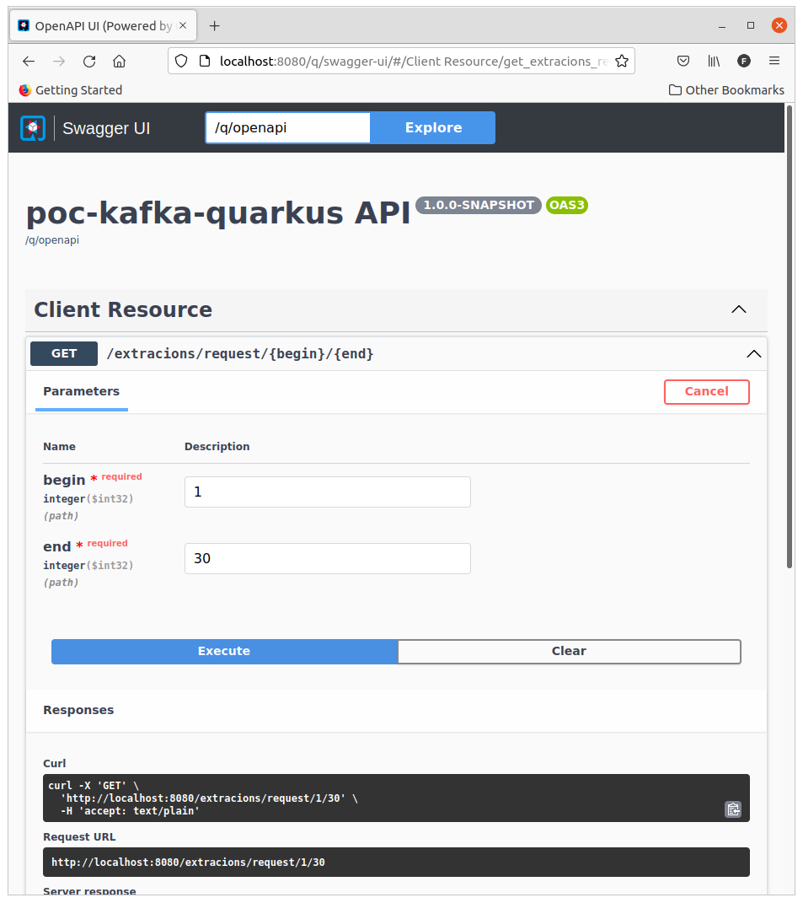
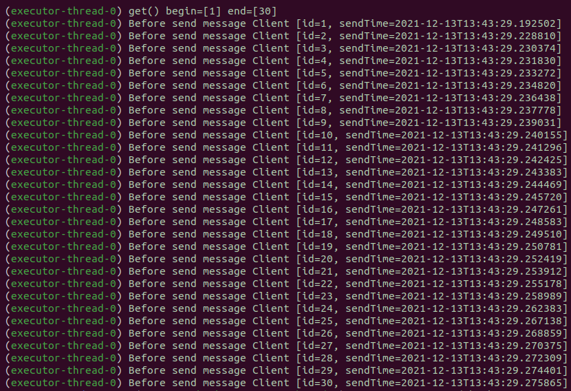
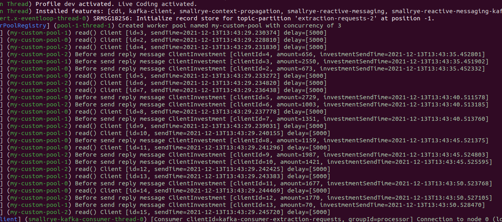
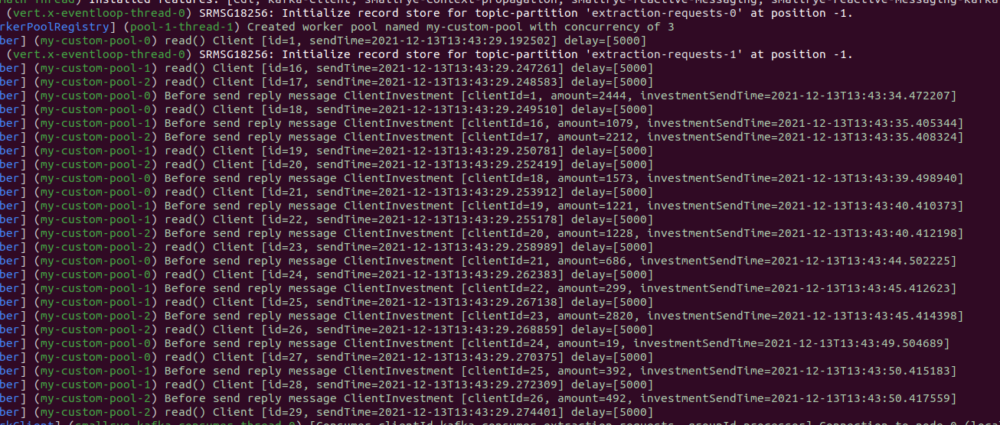

# poc-kafka-quarkus
POC to parallelize long time processes using Kafka and Quarkus.

Imagine you have a big amount of items to process and each one takes a long time to finish.

This POC proposes one solution to diminish the overall process time.

The idea is simple, one application, the `producer`, publishes messages on a Kafka topic and another application, the `processor`, reads these messages and process them.

If the messages don't need to be processed in an ordered way, we can configure the application, using SmallRye Reactive Message, to create a pool of threads and process multiple messages simultaneously. 

Kafka also allows that we consume messages from its topic from multiple instances of our application. To achieve this, we must configure the partition number of the topic. For instance, if our topic has a partition number of three and we run four instances of our application, three instances will be able to process one specific partition and the fourth will remain idle.

In this POC I use both ideas, that is I run the processing application in multiple instances and each instance has its own thread pool that processes multiple messages simultaneously.


# POC in action

Just [run](#instructions-to-run) the application, access the Swagger-UI to inform the quantity of items to process, execute it and check the results on the console log of the `producer` and the `processor` instances.

## Swagger

The Swagger-UI is on http://localhost:8080/q/swagger-ui



## Producer sent messages



## Processor instances receiving and processing messages

### 1st instance with partition "2"



### 2nd instance with partitions "0" and "1"




# Instructions to run


## Running everything with Docker Compose

### Compile the two projects

Enter the processor folder and run:
```
$ ./mvnw package
```

Enter the producer folder and run:
```
$ ./mvnw package
```

### Run the Docker Compose

On the root folder, run:
```
$ docker-compose up
```

If you want to run multiple instances of the `processor`, just pass the `scale` argument:
```
$ docker-compose up --scale processor=2
```

The `NUM_PARTITIONS` parameter of Kafka in the docker-compose file says how many partitions the topics will have.

## Running in development mode

### Start producer and processor

Enter the processor folder and run:
```
$ mvn quarkus:dev
```

Enter the producer folder and run:
```
$ mvn quarkus:dev -Ddebug=5006
```

In this mode, Quarkus will automatically download one Kafka image and run it for you.


# Kafka concepts

## Partitions

The `num.partitions` parameter defines how many partitions the topic will have.

## Consumer groups

The consumer group is defined by one id.

One consumer group will receive all messages sent to a topic.

One consumer group can have 'n' instances of applications running.

Each instance of the consumer group will process messages from some partitons of the topic.

## Consumer groups and partitions

Each instance of the consumer group will be able to read one or more partitions of the topic.

If you have more consumers than partitions, some consumers will remain idle. 


# Quarkus and SmallRye Reactive Message tips

## Processing messages in multiple worker threads

If the messages don't need to be processed in order, you can use the following annotation:
```java
@Incoming("extraction-requests")
@Blocking(ordered = false, value = "my-custom-pool")
public void read(Client client) {
```

Inform the number of threads of your `my-custom-pool` in your application.properties:
```properties
smallrye.messaging.worker.my-custom-pool.max-concurrency=3
```

## Quarkus dev mode

You can inform the number of partitions the topic will have in your Kafka test container with this parameter, informing your topic name (in this case, extraction-requests) :
```
quarkus.kafka.devservices.topic-partitions.extraction-requests=3
```


# Credits

https://quarkus.io/guides/kafka

https://strimzi.io/docs/operators/latest/using.html

## smallrye

https://smallrye.io/smallrye-reactive-messaging/smallrye-reactive-messaging/3.13/index.html

https://smallrye.io/smallrye-reactive-messaging/smallrye-reactive-messaging/3.1/advanced/blocking.html

https://smallrye.io/smallrye-reactive-messaging/smallrye-reactive-messaging/3.1/emitter/emitter.html#_emitter_and_channel

